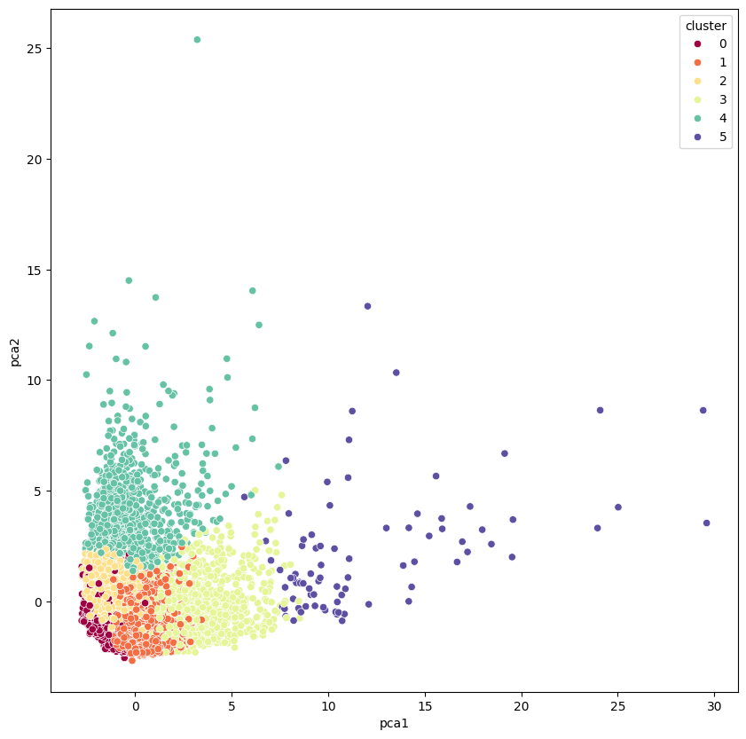

# Customer Segmentation Using Credit Card Data

This project uses credit card data to perform customer segmentation using the K-means clustering algorithm. 

Customer segmentation groups customers based on shared characteristics and behaviors, allowing businesses to customize marketing strategies and services to maximize customer value.

The dataset is available on Kaggle [here](https://www.kaggle.com/datasets/arjunbhasin2013/ccdata).

This project was completed in reference to these sources:

*   https://www.kaggle.com/code/prashant111/k-means-clustering-with-python
*   https://baotramduong.medium.com/data-science-project-customer-market-segmentation-with-k-means-and-pca-techniques-in-unsupervised-7aae88d52159
*   https://realpython.com/k-means-clustering-python/

